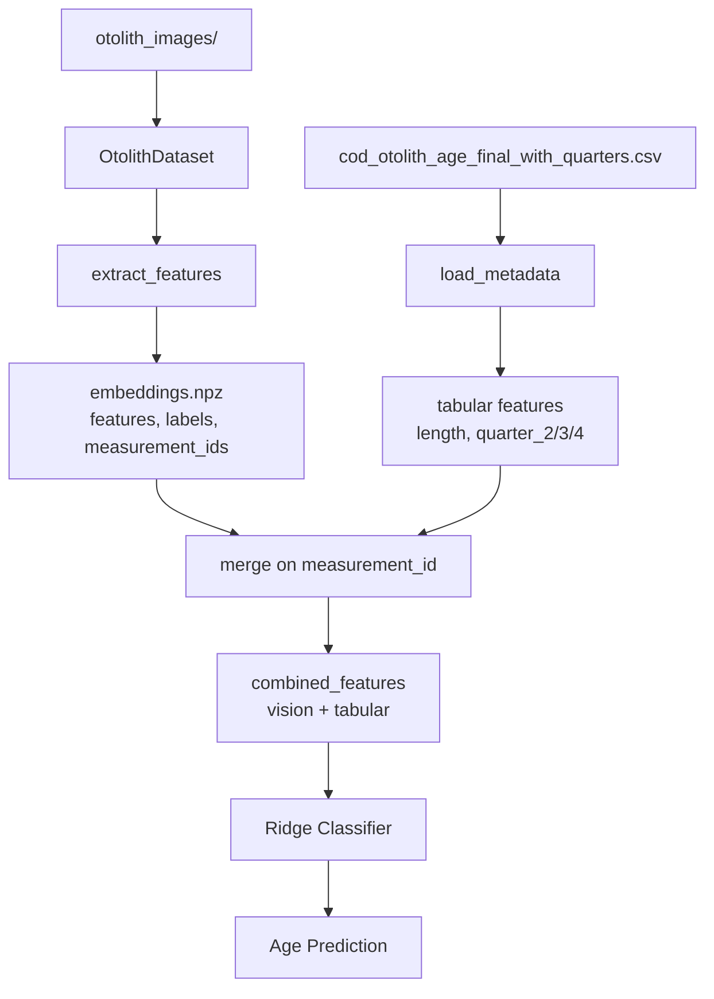

# feat: Add Length and Quarter Features to Vision Embeddings

## Overview

Extend the otolith age prediction pipeline to combine vision embeddings (CLIP/SigLIP2) with tabular metadata features (fish length and capture quarter), following the methodology from Sigurðardóttir et al. (2023).

**Key Goals:**
1. Maintain mapping between embeddings and `measurement_id` for traceability
2. Add `length` (scaled by 0.01) and `quarter` (one-hot encoded) to feature vectors
3. Enable flexible addition of other tabular features in the future

## Problem Statement / Motivation

The current pipeline extracts vision embeddings from otolith images but discards valuable metadata. The reference paper shows that combining vision features with tabular data (fish length, capture quarter) improves age prediction accuracy. The CSV file `cod_otolith_age_final_with_quarters.csv` contains:
- `measurement_id` - maps to image filename
- `length` - fish length in cm
- `quarter_2`, `quarter_3`, `quarter_4` - one-hot encoded capture quarter (Q1 is baseline)

## Proposed Solution

### Architecture

```
┌─────────────────────────────────────────────────────────────────┐
│                    Current Flow                                  │
├─────────────────────────────────────────────────────────────────┤
│  Images → [Vision Encoder] → embeddings.npz → Ridge → Age       │
│           (features, labels)                                     │
└─────────────────────────────────────────────────────────────────┘

                              ↓ BECOMES ↓

┌─────────────────────────────────────────────────────────────────┐
│                    New Flow                                      │
├─────────────────────────────────────────────────────────────────┤
│  Images → [Vision Encoder] → embeddings.npz → ┐                 │
│           (features, labels, measurement_ids)  ├→ Ridge → Age   │
│  CSV → [Merge on measurement_id] → tabular ───┘                 │
│        (length*0.01, quarter_2, quarter_3, quarter_4)           │
└─────────────────────────────────────────────────────────────────┘
```

### Data Flow



## Technical Approach

### Phase 1: Modify Embedding Extraction to Store measurement_ids

**File: `src/models/feature_extractor.py`**

```python
# src/models/feature_extractor.py:73-119 - modify extract_features()

def extract_features(
    model: torch.nn.Module,
    dataloader: torch.utils.data.DataLoader,
    device: Optional[torch.device] = None,
    normalize: bool = True,
    show_progress: bool = True,
    return_paths: bool = False,  # NEW: optionally return image paths
) -> Union[Tuple[np.ndarray, np.ndarray], Tuple[np.ndarray, np.ndarray, List[str]]]:
    """
    Extract image features using a frozen vision encoder.

    Returns:
        If return_paths=False: (features, labels)
        If return_paths=True: (features, labels, paths)
    """
    # ... existing extraction code ...

    if return_paths:
        paths = dataloader.dataset.get_paths()
        return features, labels, [str(p) for p in paths]
    return features, labels
```

**File: `scripts/run_experiment.py`**

Modify `extract_features_for_model()` to save `measurement_ids`:

```python
# scripts/run_experiment.py:69-108

def extract_features_for_model(...) -> tuple:
    # ... existing cache check ...

    features, labels = extract_features(model, dataloader, normalize=True)

    # Extract measurement_ids from image paths
    paths = preprocessed_dataset.get_paths()
    measurement_ids = np.array([int(p.stem) for p in paths])

    # Cache with measurement_ids
    np.savez(cache_file,
             features=features,
             labels=labels,
             measurement_ids=measurement_ids)  # NEW

    return features, labels, measurement_ids
```

### Phase 2: Create Metadata Loading Utility

**New File: `src/data/metadata.py`**

```python
# src/data/metadata.py

import pandas as pd
import numpy as np
from pathlib import Path
from typing import Tuple, Optional

METADATA_COLUMNS = {
    'length': {'scale': 0.01},  # Scale to match embedding magnitude
    'quarter_2': {'scale': 1.0},
    'quarter_3': {'scale': 1.0},
    'quarter_4': {'scale': 1.0},
}

def load_metadata(
    csv_path: str = "cod_otolith_age_final_with_quarters.csv",
    columns: Optional[list] = None,
) -> pd.DataFrame:
    """
    Load metadata CSV and return relevant columns.

    Args:
        csv_path: Path to CSV file
        columns: List of columns to load (default: length + quarters)

    Returns:
        DataFrame with measurement_id as index
    """
    df = pd.read_csv(csv_path)

    if columns is None:
        columns = list(METADATA_COLUMNS.keys())

    # Keep measurement_id and requested columns
    keep_cols = ['measurement_id'] + columns
    df = df[keep_cols].copy()

    # Apply scaling
    for col, config in METADATA_COLUMNS.items():
        if col in df.columns:
            df[col] = df[col].astype(float) * config['scale']

    return df.set_index('measurement_id')


def get_tabular_features(
    measurement_ids: np.ndarray,
    metadata_df: pd.DataFrame,
) -> np.ndarray:
    """
    Get tabular features for given measurement_ids, preserving order.

    Args:
        measurement_ids: Array of measurement IDs (N,)
        metadata_df: DataFrame with measurement_id as index

    Returns:
        Tabular features array (N, n_features)

    Raises:
        ValueError: If any measurement_id is missing from metadata
    """
    # Check for missing IDs
    missing = set(measurement_ids) - set(metadata_df.index)
    if missing:
        raise ValueError(f"Missing metadata for {len(missing)} measurement_ids: {list(missing)[:5]}...")

    # Retrieve in order
    tabular = metadata_df.loc[measurement_ids].values

    return tabular.astype(np.float32)


def augment_embeddings(
    features: np.ndarray,
    measurement_ids: np.ndarray,
    metadata_csv: str = "cod_otolith_age_final_with_quarters.csv",
    columns: Optional[list] = None,
) -> np.ndarray:
    """
    Concatenate vision embeddings with tabular features.

    Args:
        features: Vision embeddings (N, embedding_dim)
        measurement_ids: Array of measurement IDs (N,)
        metadata_csv: Path to metadata CSV
        columns: Columns to add (default: length + quarters)

    Returns:
        Augmented features (N, embedding_dim + n_tabular)
    """
    metadata_df = load_metadata(metadata_csv, columns)
    tabular = get_tabular_features(measurement_ids, metadata_df)

    return np.hstack([features, tabular])
```

### Phase 3: Modify Training Script

**File: `scripts/train_shallow_classifier.py`**

```python
# scripts/train_shallow_classifier.py - add new arguments

parser.add_argument(
    "--metadata-csv",
    type=str,
    default="cod_otolith_age_final_with_quarters.csv",
    help="Path to metadata CSV file",
)
parser.add_argument(
    "--add-tabular",
    action="store_true",
    default=False,
    help="Add length and quarter features to embeddings",
)
parser.add_argument(
    "--tabular-columns",
    type=str,
    default="length,quarter_2,quarter_3,quarter_4",
    help="Comma-separated list of tabular columns to add",
)

# In load_embeddings() function:
def load_embeddings(embeddings_path: str) -> Tuple[np.ndarray, np.ndarray, np.ndarray]:
    """Load embeddings, labels, and measurement_ids from .npz file."""
    data = np.load(embeddings_path, allow_pickle=False)

    features = data["features"]
    labels = data["labels"]
    measurement_ids = data.get("measurement_ids", None)

    if measurement_ids is None:
        raise KeyError("Embeddings file missing 'measurement_ids'. Re-extract features.")

    return features, labels, measurement_ids

# In main():
features, labels, measurement_ids = load_embeddings(args.embeddings)

if args.add_tabular:
    from src.data.metadata import augment_embeddings
    columns = args.tabular_columns.split(",")
    features = augment_embeddings(features, measurement_ids, args.metadata_csv, columns)
    print(f"Augmented features shape: {features.shape}")
```

## Alternative Approaches Considered

### 1. Store Tabular Features in NPZ File
**Pros:** Single file, no CSV dependency at training time
**Cons:** Must re-extract if you want different tabular features
**Verdict:** Rejected - less flexible

### 2. Learned Fusion Layer (MLP)
**Pros:** Model learns optimal combination
**Cons:** Adds complexity, requires more data, departs from paper method
**Verdict:** Out of scope for this feature

### 3. Use Cyclic Encoding for Quarter (sin/cos)
**Pros:** CSV already has `quarter_sin`, `quarter_cos` columns
**Cons:** Paper uses one-hot encoding; 2 dims vs 3 dims
**Verdict:** Could be alternative option, add as configurable choice

## Acceptance Criteria

### Functional Requirements
- [ ] `extract_features()` can optionally return image paths
- [ ] NPZ files store `measurement_ids` alongside features and labels
- [ ] New `src/data/metadata.py` module loads and processes CSV
- [ ] `train_shallow_classifier.py` supports `--add-tabular` flag
- [ ] Features are correctly aligned by measurement_id
- [ ] Length is scaled by 0.01
- [ ] Quarter uses one-hot encoding (quarter_2, quarter_3, quarter_4)

### Non-Functional Requirements
- [ ] No breaking changes to existing workflow (tabular features optional)
- [ ] Clear error messages if measurement_ids missing from NPZ
- [ ] Memory efficient (don't load full CSV into memory if not needed)

### Quality Gates
- [ ] Manual verification: check random samples have correct metadata
- [ ] Compare model performance with/without tabular features
- [ ] Backward compatible with existing embeddings (graceful error)

## Success Metrics

| Metric | Without Tabular | With Tabular (Target) |
|--------|-----------------|----------------------|
| Accuracy | ~50% | ~52-55% |
| ±1 Accuracy | ~94% | ~95-96% |
| RMSE | ~0.84 | ~0.78-0.82 |

(Based on paper's reported improvement from adding metadata)

## Dependencies & Prerequisites

1. **Re-extract embeddings** - Need to regenerate NPZ files with measurement_ids
2. **CSV file available** - `cod_otolith_age_final_with_quarters.csv` must be present
3. **Existing code cleanup** - Remove debug code from `train_shallow_classifier.py:156-169`

## Implementation Checklist

### Files to Create
- [ ] `src/data/metadata.py` - Metadata loading and feature augmentation

### Files to Modify
- [ ] `src/models/feature_extractor.py:73-119` - Add `return_paths` parameter
- [ ] `src/data/__init__.py` - Export new metadata module
- [ ] `scripts/run_experiment.py:69-108` - Save measurement_ids to NPZ
- [ ] `scripts/train_shallow_classifier.py` - Add tabular feature arguments and loading

### Files to Regenerate
- [ ] `outputs/embeddings/clip-vit-l-14-336_embeddings.npz`
- [ ] `outputs/embeddings/siglip2-so400m-14-384_embeddings.npz`

## MVP Implementation

### src/data/metadata.py

```python
"""Metadata loading utilities for tabular feature augmentation."""

import pandas as pd
import numpy as np
from typing import Optional

def load_metadata(csv_path: str) -> pd.DataFrame:
    """Load metadata CSV with measurement_id as index."""
    df = pd.read_csv(csv_path)
    return df.set_index('measurement_id')

def augment_embeddings(
    features: np.ndarray,
    measurement_ids: np.ndarray,
    csv_path: str,
    length_scale: float = 0.01,
) -> np.ndarray:
    """
    Add length and quarter features to vision embeddings.

    Args:
        features: Vision embeddings (N, D)
        measurement_ids: Measurement IDs (N,)
        csv_path: Path to metadata CSV
        length_scale: Scale factor for length (default: 0.01)

    Returns:
        Augmented features (N, D+4) with [length, q2, q3, q4] appended
    """
    metadata = load_metadata(csv_path)

    # Get tabular features in correct order
    tabular_cols = ['length', 'quarter_2', 'quarter_3', 'quarter_4']
    tabular = metadata.loc[measurement_ids, tabular_cols].values.astype(np.float32)

    # Scale length
    tabular[:, 0] *= length_scale

    return np.hstack([features, tabular])
```

## References & Research

### Internal References
- Current embedding extraction: `src/models/feature_extractor.py:73-119`
- Dataset path handling: `src/data/dataset.py:169-176` (`get_paths()`)
- Training script: `scripts/train_shallow_classifier.py:124-169`
- Config for models: `configs/config.yaml:18-32`

### External References
- Paper methodology: Sigurðardóttir et al. (2023) - Ecological Informatics
- NumPy hstack: https://numpy.org/doc/stable/reference/generated/numpy.hstack.html
- Pandas merge: https://pandas.pydata.org/docs/reference/api/pandas.DataFrame.merge.html

### CSV Schema
```
measurement_id: int (unique, maps to image filename)
length: float (fish length in cm)
quarter: int (1-4)
quarter_2: bool (Q2 indicator)
quarter_3: bool (Q3 indicator)
quarter_4: bool (Q4 indicator)
```
