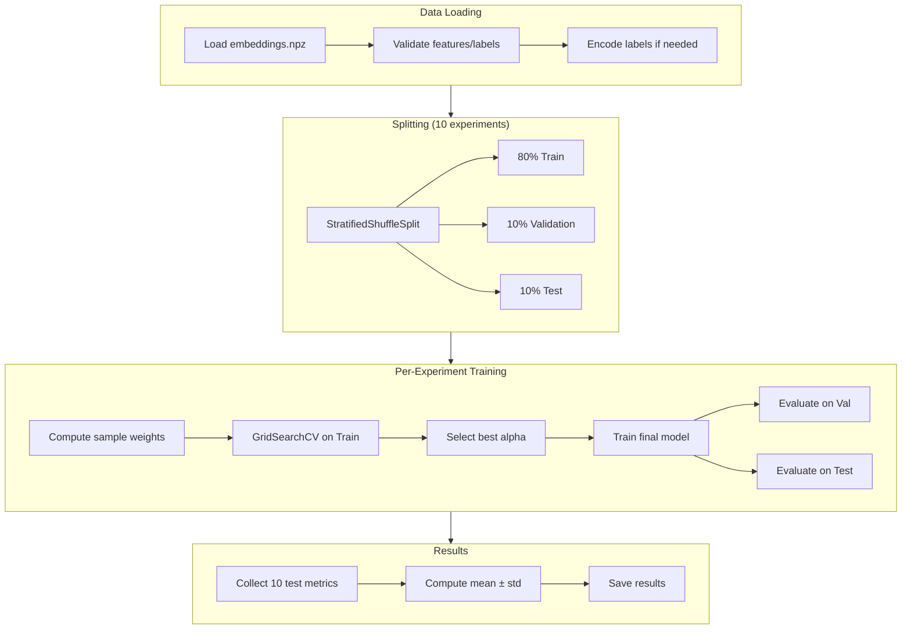

# feat: Finetune Shallow Ridge Classifier on SigLIP2 Embeddings

**Type:** Enhancement
**Priority:** High
**Complexity:** Medium

## Overview

Train a shallow Ridge Regression classifier on pre-extracted SigLIP2 embeddings for otolith age prediction, following the methodology from Sigurðardóttir et al. (2023). This feature implements the paper's experimental protocol with 10 independent train/val/test splits, grid search for hyperparameter optimization, and comprehensive metric reporting.

## Problem Statement / Motivation

The current codebase (`scripts/run_experiment.py`) uses k-fold cross-validation which produces ~80/10/10% splits. The reference paper methodology requires:
- 10 **independent** train/val/test splits at 65/15/20% ratio
- Grid search for Ridge alpha parameter in range [0.1, 19.6]
- Metrics: Precision, Recall, F1-Score, Accuracy (currently missing Precision, Recall, F1)
- Class weights to handle dataset imbalance (ages 1-10 with samples ranging from 110 to 1941)

This feature enables direct comparison with the paper's results and establishes a proper experimental baseline for SigLIP2 embeddings.

## Current Data Analysis

```
Embeddings: outputs/embeddings/siglip2-so400m-14-384_embeddings.npz
  - Keys: 'features' (8637, 1152), 'labels' (8637,)
  - 10 age classes (1-10)
  - Class distribution (imbalanced):
    Age 1: 110 samples (1.3%)
    Age 2: 223 samples (2.6%)
    Age 3: 348 samples (4.0%)
    Age 4: 768 samples (8.9%)
    Age 5: 1695 samples (19.6%)
    Age 6: 1941 samples (22.5%)  <- majority
    Age 7: 1477 samples (17.1%)
    Age 8: 927 samples (10.7%)
    Age 9: 736 samples (8.5%)
    Age 10: 412 samples (4.8%)
```

## Proposed Solution

Implement a complete training pipeline with three main components:

1. **New split function** in `src/data/splits.py` for independent 80/10/10% stratified splits
2. **Extended metrics** in `src/evaluation/metrics.py` for Precision, Recall, F1-Score
3. **New experiment script** `scripts/train_shallow_classifier.py` with GridSearchCV integration

## Technical Approach

### Architecture



### Implementation Phases

#### Phase 1: Extend Metrics Module

**File:** `src/evaluation/metrics.py`

**Tasks:**
- [ ] Add `compute_precision(y_true, y_pred, average='macro')` function
- [ ] Add `compute_recall(y_true, y_pred, average='macro')` function
- [ ] Add `compute_f1(y_true, y_pred, average='macro')` function
- [ ] Add `compute_classification_metrics(y_true, y_pred, average='macro')` returning dict with all metrics
- [ ] Update `compute_all_metrics()` to include new metrics
- [ ] Update `aggregate_fold_results()` to handle new metrics
- [ ] Update `src/evaluation/__init__.py` exports

**Code Example:**

```python
# src/evaluation/metrics.py

from sklearn.metrics import precision_score, recall_score, f1_score

def compute_precision(y_true: np.ndarray, y_pred: np.ndarray, average: str = 'macro') -> float:
    """Compute precision with specified averaging."""
    return precision_score(y_true, y_pred, average=average, zero_division=0)

def compute_recall(y_true: np.ndarray, y_pred: np.ndarray, average: str = 'macro') -> float:
    """Compute recall with specified averaging."""
    return recall_score(y_true, y_pred, average=average, zero_division=0)

def compute_f1(y_true: np.ndarray, y_pred: np.ndarray, average: str = 'macro') -> float:
    """Compute F1-score with specified averaging."""
    return f1_score(y_true, y_pred, average=average, zero_division=0)

def compute_classification_metrics(
    y_true: np.ndarray,
    y_pred: np.ndarray,
    average: str = 'macro'
) -> Dict[str, float]:
    """Compute all classification metrics."""
    return {
        'accuracy': compute_accuracy(y_true, y_pred),
        'accuracy_pm1': compute_accuracy_pm1(y_true, y_pred),
        'precision': compute_precision(y_true, y_pred, average),
        'recall': compute_recall(y_true, y_pred, average),
        'f1': compute_f1(y_true, y_pred, average),
        'rmse': compute_rmse(y_true, y_pred),
    }
```

#### Phase 2: Add Independent Splitting Function

**File:** `src/data/splits.py`

**Tasks:**
- [ ] Add `create_train_val_test_splits()` function using StratifiedShuffleSplit
- [ ] Handle rare class edge cases (classes with <10 samples)
- [ ] Save split indices for reproducibility
- [ ] Update `src/data/__init__.py` exports

**Code Example:**

```python
# src/data/splits.py

from sklearn.model_selection import StratifiedShuffleSplit

def create_train_val_test_splits(
    labels: np.ndarray,
    n_experiments: int = 10,
    train_ratio: float = 0.8,
    val_ratio: float = 0.1,
    test_ratio: float = 0.1,
    random_state: int = 42,
) -> List[DataSplit]:
    """
    Create n independent stratified train/val/test splits.

    Unlike k-fold CV, each split is independent (samples can appear
    in test sets of multiple splits). Follows paper's methodology.

    Args:
        labels: Array of class labels
        n_experiments: Number of independent splits to create
        train_ratio: Proportion for training (default: 0.65)
        val_ratio: Proportion for validation (default: 0.15)
        test_ratio: Proportion for testing (default: 0.20)
        random_state: Base random seed

    Returns:
        List of DataSplit objects
    """
    assert abs(train_ratio + val_ratio + test_ratio - 1.0) < 1e-6

    splits = []
    indices = np.arange(len(labels))

    for exp_idx in range(n_experiments):
        seed = random_state + exp_idx

        # First split: separate test set
        sss_test = StratifiedShuffleSplit(
            n_splits=1, test_size=test_ratio, random_state=seed
        )
        train_val_idx, test_idx = next(sss_test.split(indices, labels))

        # Second split: separate train and val
        val_size_adjusted = val_ratio / (train_ratio + val_ratio)
        sss_val = StratifiedShuffleSplit(
            n_splits=1, test_size=val_size_adjusted, random_state=seed
        )
        train_idx_local, val_idx_local = next(
            sss_val.split(train_val_idx, labels[train_val_idx])
        )

        train_idx = train_val_idx[train_idx_local]
        val_idx = train_val_idx[val_idx_local]

        splits.append(DataSplit(
            train_indices=train_idx,
            val_indices=val_idx,
            test_indices=test_idx,
            fold=exp_idx,
        ))

    return splits
```

#### Phase 3: Create Training Script

**File:** `scripts/train_shallow_classifier.py`

**Tasks:**
- [ ] Create argument parser for embeddings path, config, etc.
- [ ] Load and validate embeddings file (keys: 'features', 'labels')
- [ ] Implement GridSearchCV with sample weights for class balancing
- [ ] Run 10 independent experiments with progress tracking
- [ ] Aggregate results with mean ± std
- [ ] Save results to JSON/CSV files
- [ ] Print formatted results table

**Code Example:**

```python
#!/usr/bin/env python3
"""
Train Ridge Classifier on SigLIP2 Embeddings.

Runs 10 independent experiments with stratified 65/15/20% splits,
GridSearchCV for alpha optimization, and comprehensive metrics.

Usage:
    python scripts/train_shallow_classifier.py
    python scripts/train_shallow_classifier.py --embeddings outputs/embeddings/siglip2-so400m-14-384_embeddings.npz
"""

import argparse
import numpy as np
from pathlib import Path
from sklearn.linear_model import RidgeClassifier
from sklearn.model_selection import GridSearchCV, StratifiedKFold
from sklearn.utils.class_weight import compute_sample_weight
from tqdm import tqdm

from src.data import create_train_val_test_splits
from src.evaluation import compute_classification_metrics, aggregate_fold_results


def run_single_experiment(
    features: np.ndarray,
    labels: np.ndarray,
    split: DataSplit,
    alpha_range: np.ndarray,
    cv_folds: int = 5,
) -> Dict[str, Any]:
    """Run single experiment with GridSearchCV."""

    X_train = features[split.train_indices]
    y_train = labels[split.train_indices]
    X_val = features[split.val_indices]
    y_val = labels[split.val_indices]
    X_test = features[split.test_indices]
    y_test = labels[split.test_indices]

    # Compute sample weights for class balancing
    sample_weights = compute_sample_weight('balanced', y_train)

    # GridSearchCV on training data
    clf = RidgeClassifier(random_state=split.fold)
    param_grid = {'alpha': alpha_range}
    cv = StratifiedKFold(n_splits=cv_folds, shuffle=True, random_state=split.fold)

    grid_search = GridSearchCV(
        clf, param_grid, cv=cv, scoring='f1_macro', n_jobs=-1, refit=True
    )
    grid_search.fit(X_train, y_train, sample_weight=sample_weights)

    best_alpha = grid_search.best_params_['alpha']
    best_model = grid_search.best_estimator_

    # Evaluate on validation (monitoring only)
    y_val_pred = best_model.predict(X_val)
    val_metrics = compute_classification_metrics(y_val, y_val_pred)

    # Evaluate on test (final evaluation)
    y_test_pred = best_model.predict(X_test)
    test_metrics = compute_classification_metrics(y_test, y_test_pred)

    return {
        'experiment': split.fold,
        'best_alpha': best_alpha,
        'best_cv_score': grid_search.best_score_,
        'val_metrics': val_metrics,
        'test_metrics': test_metrics,
    }
```

#### Phase 4: Update Configuration

**File:** `configs/config.yaml`

**Tasks:**
- [ ] Add `shallow_finetune` section with alpha range, CV folds, metric averaging
- [ ] Document all configuration options

**Config Addition:**

```yaml
# =============================================================================
# Shallow Classifier Finetuning (Paper Replication)
# =============================================================================
shallow_finetune:
  # Embeddings to use
  embedding_model: "siglip2-so400m-14-384"
  embedding_key: "features"
  label_key: "labels"

  # Experiment settings
  n_experiments: 10

  # Data splitting (paper methodology)
  train_ratio: 0.65
  val_ratio: 0.15
  test_ratio: 0.20

  # Ridge hyperparameter grid search
  alpha_min: 0.1
  alpha_max: 19.6
  alpha_steps: 20  # Linear spacing: np.linspace(0.1, 19.6, 20)

  # GridSearchCV settings
  cv_folds: 5
  scoring: "f1_macro"  # Paper uses macro averaging for balanced evaluation

  # Metric computation
  metric_average: "macro"  # 'macro', 'weighted', or 'micro'
  compute_per_class: false
  compute_confusion_matrix: false

  # Output
  save_models: false
  save_split_indices: true
```

## Acceptance Criteria

### Functional Requirements

- [ ] Loading embeddings from `outputs/embeddings/siglip2-so400m-14-384_embeddings.npz` with keys 'features' and 'labels'
- [ ] Creating 10 independent 65/15/20% stratified splits
- [ ] Running GridSearchCV with alpha in [0.1, 19.6] using 5-fold CV
- [ ] Computing class-weighted sample weights using sklearn's `compute_sample_weight('balanced', y_train)`
- [ ] Computing Precision, Recall, F1-Score (macro), and Accuracy on test set
- [ ] Reporting mean ± std across all 10 experiments
- [ ] Saving results to `outputs/results/` directory

### Non-Functional Requirements

- [ ] Experiment runtime < 30 minutes on Apple Silicon MPS
- [ ] Memory usage < 8GB (embeddings are ~40MB, models are lightweight)
- [ ] Reproducible results with fixed random seeds (42, 43, ..., 51)

### Quality Gates

- [ ] All new functions have docstrings and type hints
- [ ] Unit tests for new split function and metrics
- [ ] Results comparable to paper's reported metrics (within reasonable variance)

## Success Metrics

| Metric | Paper Reference (Cod) | Target |
|--------|----------------------|--------|
| Accuracy | 50.47 ± 2.37% | Within 5% of paper |
| ±1 Accuracy | 94.10 ± 1.24% | Within 2% of paper |
| RMSE | 0.84 ± 0.04 | Within 0.1 of paper |
| F1 (macro) | Not reported | Compute and report |

**Note:** Our dataset has 8637 samples vs paper's 1170 samples, so results may differ.

## Dependencies & Prerequisites

### Required Libraries
- scikit-learn >= 1.5.0 (for RidgeClassifier, GridSearchCV, StratifiedShuffleSplit)
- numpy >= 1.24.0 (for array operations)
- tqdm (for progress bars)

### Existing Code Dependencies
- `src/data/dataset.py`: OtolithDataset class (not needed for this feature)
- `src/models/shallow_models.py`: Reference for Ridge patterns
- `src/evaluation/metrics.py`: Base metrics module to extend
- `src/utils/config.py`: Configuration loading

### Data Prerequisites
- Pre-extracted SigLIP2 embeddings in `outputs/embeddings/siglip2-so400m-14-384_embeddings.npz`

## Risk Analysis & Mitigation

| Risk | Likelihood | Impact | Mitigation |
|------|------------|--------|------------|
| Rare class stratification failure | Low | High | Remove classes with <10 samples or use warning |
| GridSearchCV memory issues | Low | Medium | Use n_jobs=1 if OOM occurs |
| Results don't match paper | Medium | Low | Expected due to larger dataset; document differences |
| RidgeClassifier convergence issues | Very Low | Low | Ridge with closed-form solution rarely fails |

## Files to Create/Modify

### New Files
1. `scripts/train_shallow_classifier.py` - Main training script

### Modified Files
1. `src/data/splits.py` - Add `create_train_val_test_splits()` function
2. `src/data/__init__.py` - Export new function
3. `src/evaluation/metrics.py` - Add precision, recall, F1 functions
4. `src/evaluation/__init__.py` - Export new functions
5. `configs/config.yaml` - Add `shallow_finetune` section

### Output Files (Generated)
1. `outputs/results/shallow_siglip2/results.json` - Full experiment results
2. `outputs/results/shallow_siglip2/summary.csv` - Per-experiment summary
3. `outputs/results/shallow_siglip2/splits.json` - Saved split indices

## Implementation Checklist

### Setup
- [ ] Read and understand existing code patterns in `src/models/shallow_models.py`
- [ ] Verify embeddings file structure matches expectations

### Phase 1: Metrics (Estimated: 15 min)
- [ ] Add precision/recall/f1 functions to `src/evaluation/metrics.py`
- [ ] Add tests for new metrics
- [ ] Update `__init__.py` exports

### Phase 2: Splitting (Estimated: 20 min)
- [ ] Add `create_train_val_test_splits()` to `src/data/splits.py`
- [ ] Add tests for edge cases (rare classes, stratification)
- [ ] Update `__init__.py` exports

### Phase 3: Training Script (Estimated: 45 min)
- [ ] Create `scripts/train_shallow_classifier.py`
- [ ] Implement argument parsing
- [ ] Implement data loading and validation
- [ ] Implement GridSearchCV with sample weights
- [ ] Implement results aggregation and saving
- [ ] Add progress tracking with tqdm

### Phase 4: Configuration (Estimated: 10 min)
- [ ] Add `shallow_finetune` section to `configs/config.yaml`
- [ ] Document all configuration options

### Validation
- [ ] Run smoke test with 2 experiments
- [ ] Verify reproducibility with same seeds
- [ ] Compare metrics format with paper

## References & Research

### Internal References
- Existing Ridge implementation: `src/models/shallow_models.py:17-30`
- K-fold splitting pattern: `src/data/splits.py:38-91`
- Metrics aggregation: `src/evaluation/metrics.py:54-71`
- Configuration structure: `configs/config.yaml:39-51`

### External References
- [sklearn RidgeClassifier](https://scikit-learn.org/stable/modules/generated/sklearn.linear_model.RidgeClassifier.html)
- [sklearn GridSearchCV](https://scikit-learn.org/stable/modules/generated/sklearn.model_selection.GridSearchCV.html)
- [sklearn StratifiedShuffleSplit](https://scikit-learn.org/stable/modules/generated/sklearn.model_selection.StratifiedShuffleSplit.html)
- [sklearn compute_sample_weight](https://scikit-learn.org/stable/modules/generated/sklearn.utils.class_weight.compute_sample_weight.html)
- [sklearn classification metrics](https://scikit-learn.org/stable/modules/generated/sklearn.metrics.classification_report.html)

### Related Work
- Paper: Sigurðardóttir et al. (2023) - Ecological Informatics

---

**Created:** 2026-01-14
**Author:** Claude Code
**Status:** Ready for implementation
