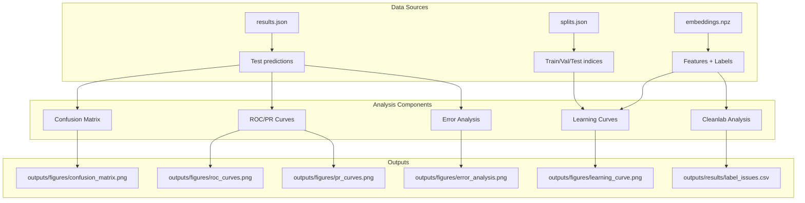

# feat: Performance Analysis and Evaluation for Otolith Age Classification

**Type:** Enhancement
**Priority:** High
**Complexity:** Medium-High
**Created:** 2026-01-23

## Overview

Implement comprehensive performance analysis and evaluation tools for the otolith age classification model. This includes visualization of classification metrics (confusion matrices, ROC curves, precision-recall curves), error analysis for misclassified samples, learning curves to assess data efficiency, and data quality analysis using cleanlab.

## Problem Statement / Motivation

After training the Ridge classifier on SigLIP2 embeddings, we need to:
1. **Understand model behavior** - Where does the model struggle? Which age classes are confused?
2. **Visualize performance** - Create publication-ready figures for the paper
3. **Assess data efficiency** - How much data does the model need? Is more data beneficial?
4. **Identify data quality issues** - Are there mislabeled samples affecting performance?

Current state:
- Model achieves ~51% accuracy, ~95% ±1 accuracy across 10 experiments
- Results stored in `outputs/results/shallow_siglip2/results.json`
- No visualization module exists (`src/visualization/__init__.py` is a placeholder)
- No error analysis or learning curve functionality

## Proposed Solution

Create four interconnected analysis components:

```
┌─────────────────────────────────────────────────────────────────┐
│                    Performance Analysis Pipeline                 │
├─────────────────────────────────────────────────────────────────┤
│  1. Classification Metrics Visualization                         │
│     ├── Confusion Matrix (heatmap)                              │
│     ├── ROC Curves (multi-class OvR)                            │
│     └── Precision-Recall Curves (per class)                     │
│                                                                  │
│  2. Error Analysis                                               │
│     ├── Misclassified sample identification                     │
│     ├── Error > 1 class analysis                                │
│     └── Per-class error breakdown                               │
│                                                                  │
│  3. Learning Curves                                              │
│     ├── Train with 10%, 20%, ..., 100% of data                 │
│     ├── Evaluate on fixed test set                              │
│     └── Plot accuracy vs training size                          │
│                                                                  │
│  4. Data Quality Analysis (cleanlab)                            │
│     ├── Find potential label issues                             │
│     ├── Rank samples by label quality                           │
│     └── Generate data quality report                            │
└─────────────────────────────────────────────────────────────────┘
```

## Technical Approach

### Architecture



### Implementation Phases

#### Phase 1: Classification Metrics Visualization

**File:** `src/visualization/classification_plots.py`

**Tasks:**
- [ ] Create `plot_confusion_matrix()` - Aggregate confusion matrix across experiments
- [ ] Create `plot_roc_curves()` - Multi-class ROC curves (One-vs-Rest)
- [ ] Create `plot_precision_recall_curves()` - Per-class PR curves
- [ ] Create `plot_metrics_summary()` - Bar chart with error bars for all metrics

**Code Pattern:**

```python
# src/visualization/classification_plots.py

import numpy as np
import matplotlib.pyplot as plt
import seaborn as sns
from sklearn.metrics import confusion_matrix, roc_curve, auc, precision_recall_curve
from sklearn.preprocessing import label_binarize
from typing import List, Dict, Optional, Tuple
from pathlib import Path


def plot_confusion_matrix(
    y_true: np.ndarray,
    y_pred: np.ndarray,
    class_labels: Optional[List[str]] = None,
    normalize: str = "true",  # "true", "pred", "all", or None
    title: str = "Confusion Matrix",
    cmap: str = "Blues",
    figsize: Tuple[int, int] = (10, 8),
    save_path: Optional[Path] = None,
) -> plt.Figure:
    """
    Plot confusion matrix as a heatmap.

    Args:
        y_true: True labels
        y_pred: Predicted labels
        class_labels: Labels for each class (default: 1-10 for ages)
        normalize: Normalization method
        title: Plot title
        cmap: Colormap for heatmap
        figsize: Figure size
        save_path: Path to save figure

    Returns:
        matplotlib Figure object
    """
    if class_labels is None:
        class_labels = [str(i) for i in range(1, 11)]

    cm = confusion_matrix(y_true, y_pred, labels=range(1, 11))

    if normalize == "true":
        cm = cm.astype("float") / cm.sum(axis=1, keepdims=True)
        fmt = ".2f"
    elif normalize == "pred":
        cm = cm.astype("float") / cm.sum(axis=0, keepdims=True)
        fmt = ".2f"
    elif normalize == "all":
        cm = cm.astype("float") / cm.sum()
        fmt = ".2f"
    else:
        fmt = "d"

    fig, ax = plt.subplots(figsize=figsize)
    sns.heatmap(
        cm,
        annot=True,
        fmt=fmt,
        cmap=cmap,
        xticklabels=class_labels,
        yticklabels=class_labels,
        ax=ax,
        square=True,
        linewidths=0.5,
        cbar_kws={"shrink": 0.8},
    )
    ax.set_xlabel("Predicted Age", fontsize=12)
    ax.set_ylabel("True Age", fontsize=12)
    ax.set_title(title, fontsize=14)

    plt.tight_layout()

    if save_path:
        fig.savefig(save_path, dpi=300, bbox_inches="tight")

    return fig


def plot_roc_curves(
    y_true: np.ndarray,
    y_score: np.ndarray,
    n_classes: int = 10,
    class_labels: Optional[List[str]] = None,
    figsize: Tuple[int, int] = (10, 8),
    save_path: Optional[Path] = None,
) -> plt.Figure:
    """
    Plot ROC curves for multi-class classification (One-vs-Rest).

    Args:
        y_true: True labels (1-10)
        y_score: Predicted probabilities or decision values (N, n_classes)
        n_classes: Number of classes
        class_labels: Labels for each class
        figsize: Figure size
        save_path: Path to save figure

    Returns:
        matplotlib Figure object
    """
    if class_labels is None:
        class_labels = [f"Age {i}" for i in range(1, n_classes + 1)]

    # Binarize labels for OvR
    y_bin = label_binarize(y_true, classes=range(1, n_classes + 1))

    fig, ax = plt.subplots(figsize=figsize)

    colors = plt.cm.tab10(np.linspace(0, 1, n_classes))

    # Compute ROC curve for each class
    for i in range(n_classes):
        fpr, tpr, _ = roc_curve(y_bin[:, i], y_score[:, i])
        roc_auc = auc(fpr, tpr)
        ax.plot(fpr, tpr, color=colors[i], lw=2,
                label=f"{class_labels[i]} (AUC = {roc_auc:.2f})")

    ax.plot([0, 1], [0, 1], "k--", lw=2, label="Random Classifier")
    ax.set_xlim([0.0, 1.0])
    ax.set_ylim([0.0, 1.05])
    ax.set_xlabel("False Positive Rate", fontsize=12)
    ax.set_ylabel("True Positive Rate", fontsize=12)
    ax.set_title("ROC Curves (One-vs-Rest)", fontsize=14)
    ax.legend(loc="lower right", fontsize=9)
    ax.grid(True, alpha=0.3)

    plt.tight_layout()

    if save_path:
        fig.savefig(save_path, dpi=300, bbox_inches="tight")

    return fig
```

#### Phase 2: Error Analysis

**File:** `src/evaluation/error_analysis.py`

**Tasks:**
- [ ] Create `identify_misclassified_samples()` - Find all misclassifications
- [ ] Create `analyze_error_magnitude()` - Group errors by |true - pred|
- [ ] Create `get_large_errors()` - Filter errors > ±1 class
- [ ] Create `plot_error_distribution()` - Histogram of prediction errors
- [ ] Create `plot_error_by_class()` - Per-class error breakdown

**Code Pattern:**

```python
# src/evaluation/error_analysis.py

import numpy as np
import pandas as pd
import matplotlib.pyplot as plt
from typing import Tuple, List, Dict, Optional
from pathlib import Path


def identify_misclassified_samples(
    y_true: np.ndarray,
    y_pred: np.ndarray,
    measurement_ids: Optional[np.ndarray] = None,
) -> pd.DataFrame:
    """
    Identify all misclassified samples with their error magnitude.

    Args:
        y_true: True labels
        y_pred: Predicted labels
        measurement_ids: Optional sample identifiers

    Returns:
        DataFrame with columns: [index, measurement_id, true_age, pred_age, error]
    """
    errors = y_true - y_pred
    abs_errors = np.abs(errors)
    misclassified_mask = errors != 0

    data = {
        "index": np.where(misclassified_mask)[0],
        "true_age": y_true[misclassified_mask],
        "pred_age": y_pred[misclassified_mask],
        "error": errors[misclassified_mask],
        "abs_error": abs_errors[misclassified_mask],
    }

    if measurement_ids is not None:
        data["measurement_id"] = measurement_ids[misclassified_mask]

    df = pd.DataFrame(data)
    return df.sort_values("abs_error", ascending=False)


def get_large_errors(
    y_true: np.ndarray,
    y_pred: np.ndarray,
    threshold: int = 1,
    measurement_ids: Optional[np.ndarray] = None,
) -> pd.DataFrame:
    """
    Get samples where |prediction error| > threshold.

    Args:
        y_true: True labels
        y_pred: Predicted labels
        threshold: Error threshold (default: 1 for ±1 accuracy)
        measurement_ids: Optional sample identifiers

    Returns:
        DataFrame with large error samples
    """
    all_errors = identify_misclassified_samples(y_true, y_pred, measurement_ids)
    return all_errors[all_errors["abs_error"] > threshold]


def plot_error_distribution(
    y_true: np.ndarray,
    y_pred: np.ndarray,
    title: str = "Prediction Error Distribution",
    figsize: Tuple[int, int] = (10, 6),
    save_path: Optional[Path] = None,
) -> plt.Figure:
    """
    Plot histogram of prediction errors (true - pred).

    Args:
        y_true: True labels
        y_pred: Predicted labels
        title: Plot title
        figsize: Figure size
        save_path: Path to save figure

    Returns:
        matplotlib Figure object
    """
    errors = y_true - y_pred

    fig, ax = plt.subplots(figsize=figsize)

    # Create bins centered on integers
    bins = np.arange(-9.5, 10.5, 1)

    ax.hist(errors, bins=bins, edgecolor="black", alpha=0.7)
    ax.axvline(x=0, color="red", linestyle="--", linewidth=2, label="Perfect prediction")
    ax.axvline(x=-1, color="orange", linestyle=":", linewidth=1.5, alpha=0.7)
    ax.axvline(x=1, color="orange", linestyle=":", linewidth=1.5, alpha=0.7, label="±1 boundary")

    ax.set_xlabel("Prediction Error (True - Predicted)", fontsize=12)
    ax.set_ylabel("Count", fontsize=12)
    ax.set_title(title, fontsize=14)
    ax.legend()
    ax.grid(True, alpha=0.3)

    # Add statistics annotation
    correct = np.sum(errors == 0)
    within_one = np.sum(np.abs(errors) <= 1)
    total = len(errors)

    stats_text = f"Exact: {correct}/{total} ({100*correct/total:.1f}%)\n"
    stats_text += f"Within ±1: {within_one}/{total} ({100*within_one/total:.1f}%)"
    ax.annotate(stats_text, xy=(0.95, 0.95), xycoords="axes fraction",
                ha="right", va="top", fontsize=10,
                bbox=dict(boxstyle="round", facecolor="wheat", alpha=0.5))

    plt.tight_layout()

    if save_path:
        fig.savefig(save_path, dpi=300, bbox_inches="tight")

    return fig
```

#### Phase 3: Learning Curves

**File:** `src/evaluation/learning_curves.py`

**Tasks:**
- [ ] Create `compute_learning_curve()` - Train on subsets, evaluate on fixed test
- [ ] Create `plot_learning_curve()` - Plot accuracy vs training size
- [ ] Create `run_learning_curve_experiment()` - Full experiment across all splits

**Code Pattern:**

```python
# src/evaluation/learning_curves.py

import numpy as np
from sklearn.linear_model import Ridge
from sklearn.utils.class_weight import compute_sample_weight
import matplotlib.pyplot as plt
from typing import List, Dict, Tuple, Optional
from pathlib import Path
from tqdm import tqdm

from src.data import DataSplit
from src.evaluation import compute_classification_metrics


def compute_learning_curve(
    features: np.ndarray,
    labels: np.ndarray,
    split: DataSplit,
    train_fractions: List[float] = None,
    alpha: float = 0.1,
    random_state: int = 42,
) -> Dict[str, List[float]]:
    """
    Compute learning curve for a single split.

    Args:
        features: Feature matrix (N, D)
        labels: Label vector (N,)
        split: DataSplit with train/val/test indices
        train_fractions: List of fractions (default: [0.1, 0.2, ..., 1.0])
        alpha: Ridge regularization parameter
        random_state: Random seed for subsampling

    Returns:
        Dictionary with train_fractions and metrics at each fraction
    """
    if train_fractions is None:
        train_fractions = [0.1, 0.2, 0.3, 0.4, 0.5, 0.6, 0.7, 0.8, 0.9, 1.0]

    X_train_full = features[split.train_indices]
    y_train_full = labels[split.train_indices]
    X_test = features[split.test_indices]
    y_test = labels[split.test_indices]

    results = {
        "train_fraction": train_fractions,
        "train_size": [],
        "accuracy": [],
        "accuracy_pm1": [],
        "rmse": [],
    }

    rng = np.random.RandomState(random_state)

    for frac in train_fractions:
        n_samples = int(len(X_train_full) * frac)
        indices = rng.choice(len(X_train_full), size=n_samples, replace=False)

        X_train = X_train_full[indices]
        y_train = y_train_full[indices]

        # Compute sample weights
        sample_weights = compute_sample_weight("balanced", y_train)

        # Train model
        model = Ridge(alpha=alpha, random_state=random_state)
        model.fit(X_train, y_train, sample_weight=sample_weights)

        # Evaluate on test set
        y_pred = np.round(model.predict(X_test)).astype(int)
        metrics = compute_classification_metrics(y_test, y_pred)

        results["train_size"].append(n_samples)
        results["accuracy"].append(metrics["accuracy"])
        results["accuracy_pm1"].append(metrics["accuracy_pm1"])
        results["rmse"].append(metrics["rmse"])

    return results


def run_learning_curve_experiment(
    features: np.ndarray,
    labels: np.ndarray,
    splits: List[DataSplit],
    train_fractions: List[float] = None,
    alpha: float = 0.1,
) -> Dict[str, np.ndarray]:
    """
    Run learning curve experiment across all splits.

    Args:
        features: Feature matrix (N, D)
        labels: Label vector (N,)
        splits: List of DataSplit objects
        train_fractions: List of fractions to evaluate
        alpha: Ridge regularization parameter

    Returns:
        Dictionary with aggregated results (mean, std) at each fraction
    """
    if train_fractions is None:
        train_fractions = [0.1, 0.2, 0.3, 0.4, 0.5, 0.6, 0.7, 0.8, 0.9, 1.0]

    all_results = []

    for split in tqdm(splits, desc="Learning curve experiments"):
        result = compute_learning_curve(
            features, labels, split, train_fractions, alpha, random_state=split.fold
        )
        all_results.append(result)

    # Aggregate across splits
    aggregated = {
        "train_fraction": np.array(train_fractions),
        "train_size_mean": np.mean([r["train_size"] for r in all_results], axis=0),
    }

    for metric in ["accuracy", "accuracy_pm1", "rmse"]:
        values = np.array([r[metric] for r in all_results])
        aggregated[f"{metric}_mean"] = np.mean(values, axis=0)
        aggregated[f"{metric}_std"] = np.std(values, axis=0)

    return aggregated


def plot_learning_curve(
    learning_curve_results: Dict[str, np.ndarray],
    metric: str = "accuracy",
    title: str = "Learning Curve",
    figsize: Tuple[int, int] = (10, 6),
    save_path: Optional[Path] = None,
) -> plt.Figure:
    """
    Plot learning curve with error bands.

    Args:
        learning_curve_results: Results from run_learning_curve_experiment
        metric: Metric to plot ("accuracy", "accuracy_pm1", or "rmse")
        title: Plot title
        figsize: Figure size
        save_path: Path to save figure

    Returns:
        matplotlib Figure object
    """
    fractions = learning_curve_results["train_fraction"]
    sizes = learning_curve_results["train_size_mean"]
    means = learning_curve_results[f"{metric}_mean"]
    stds = learning_curve_results[f"{metric}_std"]

    fig, ax = plt.subplots(figsize=figsize)

    # Plot mean with error band
    ax.plot(fractions * 100, means, "b-", linewidth=2, marker="o", markersize=8)
    ax.fill_between(
        fractions * 100,
        means - stds,
        means + stds,
        alpha=0.2,
        color="blue",
    )

    ax.set_xlabel("Training Data (%)", fontsize=12)

    if metric == "rmse":
        ylabel = "RMSE"
    elif metric == "accuracy_pm1":
        ax.yaxis.set_major_formatter(plt.FuncFormatter(lambda x, _: f"{x*100:.0f}%"))
        ylabel = "±1 Accuracy"
    else:
        ax.yaxis.set_major_formatter(plt.FuncFormatter(lambda x, _: f"{x*100:.0f}%"))
        ylabel = "Accuracy"

    ax.set_ylabel(ylabel, fontsize=12)
    ax.set_title(title, fontsize=14)
    ax.grid(True, alpha=0.3)

    # Add secondary x-axis for absolute sample counts
    ax2 = ax.twiny()
    ax2.set_xlim(ax.get_xlim())
    ax2.set_xticks(fractions * 100)
    ax2.set_xticklabels([f"{int(s)}" for s in sizes], fontsize=9)
    ax2.set_xlabel("Number of Training Samples", fontsize=10)

    plt.tight_layout()

    if save_path:
        fig.savefig(save_path, dpi=300, bbox_inches="tight")

    return fig
```

#### Phase 4: Data Quality Analysis with Cleanlab

**File:** `src/evaluation/data_quality.py`

**Tasks:**
- [ ] Create `compute_out_of_fold_predictions()` - Get predictions for all samples
- [ ] Create `find_label_issues()` - Use cleanlab to identify potential mislabels
- [ ] Create `get_label_quality_scores()` - Rank samples by label quality
- [ ] Create `generate_data_quality_report()` - Summary of data quality issues

**Code Pattern:**

```python
# src/evaluation/data_quality.py

import numpy as np
import pandas as pd
from sklearn.linear_model import Ridge
from sklearn.model_selection import cross_val_predict
from typing import Dict, List, Optional, Tuple
from pathlib import Path

# Import cleanlab (will need to be added to dependencies)
try:
    from cleanlab.filter import find_label_issues as cleanlab_find_issues
    from cleanlab.rank import get_label_quality_scores as cleanlab_quality_scores
    CLEANLAB_AVAILABLE = True
except ImportError:
    CLEANLAB_AVAILABLE = False


def compute_out_of_fold_predictions(
    features: np.ndarray,
    labels: np.ndarray,
    alpha: float = 0.1,
    n_folds: int = 5,
    random_state: int = 42,
) -> np.ndarray:
    """
    Compute out-of-fold predicted probabilities using cross-validation.

    For Ridge regression, we convert continuous predictions to pseudo-probabilities
    using softmax over class distances.

    Args:
        features: Feature matrix (N, D)
        labels: Label vector (N,)
        alpha: Ridge regularization parameter
        n_folds: Number of CV folds
        random_state: Random seed

    Returns:
        Predicted probabilities array (N, n_classes)
    """
    from sklearn.model_selection import StratifiedKFold
    from scipy.special import softmax

    n_classes = len(np.unique(labels))
    classes = np.arange(labels.min(), labels.max() + 1)

    pred_probs = np.zeros((len(labels), len(classes)))

    cv = StratifiedKFold(n_splits=n_folds, shuffle=True, random_state=random_state)

    for train_idx, val_idx in cv.split(features, labels):
        X_train, X_val = features[train_idx], features[val_idx]
        y_train = labels[train_idx]

        model = Ridge(alpha=alpha, random_state=random_state)
        model.fit(X_train, y_train)

        # Get continuous predictions
        y_pred_continuous = model.predict(X_val)

        # Convert to pseudo-probabilities
        # For each prediction, compute distance to each class and apply softmax
        for i, (idx, pred) in enumerate(zip(val_idx, y_pred_continuous)):
            distances = -np.abs(classes - pred)  # Negative distance (closer = higher)
            pred_probs[idx] = softmax(distances * 2)  # Scale factor for sharper distribution

    return pred_probs


def find_label_issues(
    labels: np.ndarray,
    pred_probs: np.ndarray,
    return_indices_ranked_by: str = "self_confidence",
    n_issues: Optional[int] = None,
) -> Tuple[np.ndarray, pd.DataFrame]:
    """
    Find potential label issues using cleanlab.

    Args:
        labels: Ground truth labels
        pred_probs: Out-of-fold predicted probabilities
        return_indices_ranked_by: Ranking method for issues
        n_issues: Maximum number of issues to return (None for all)

    Returns:
        Tuple of (issue_mask, issue_details_df)
    """
    if not CLEANLAB_AVAILABLE:
        raise ImportError(
            "cleanlab is required for data quality analysis. "
            "Install with: pip install cleanlab"
        )

    # Adjust labels to 0-indexed for cleanlab
    labels_adjusted = labels - labels.min()

    # Find label issues
    issue_indices = cleanlab_find_issues(
        labels=labels_adjusted,
        pred_probs=pred_probs,
        return_indices_ranked_by=return_indices_ranked_by,
    )

    # Get quality scores for all samples
    quality_scores = cleanlab_quality_scores(
        labels=labels_adjusted,
        pred_probs=pred_probs,
    )

    # Create issue mask
    issue_mask = np.zeros(len(labels), dtype=bool)
    if n_issues:
        issue_indices = issue_indices[:n_issues]
    issue_mask[issue_indices] = True

    # Build details dataframe
    details = pd.DataFrame({
        "index": issue_indices,
        "given_label": labels[issue_indices],
        "predicted_label": pred_probs[issue_indices].argmax(axis=1) + labels.min(),
        "label_quality_score": quality_scores[issue_indices],
        "confidence_given": pred_probs[issue_indices, labels_adjusted[issue_indices]],
        "confidence_predicted": pred_probs[issue_indices].max(axis=1),
    })

    return issue_mask, details


def generate_data_quality_report(
    labels: np.ndarray,
    pred_probs: np.ndarray,
    measurement_ids: Optional[np.ndarray] = None,
    save_path: Optional[Path] = None,
) -> Dict:
    """
    Generate comprehensive data quality report.

    Args:
        labels: Ground truth labels
        pred_probs: Out-of-fold predicted probabilities
        measurement_ids: Optional sample identifiers
        save_path: Path to save report CSV

    Returns:
        Dictionary with quality metrics and issue details
    """
    if not CLEANLAB_AVAILABLE:
        raise ImportError("cleanlab is required for data quality analysis")

    labels_adjusted = labels - labels.min()

    # Get quality scores for all samples
    quality_scores = cleanlab_quality_scores(
        labels=labels_adjusted,
        pred_probs=pred_probs,
    )

    # Find issues at different thresholds
    issue_mask, issue_details = find_label_issues(labels, pred_probs)

    # Overall statistics
    report = {
        "total_samples": len(labels),
        "potential_issues": len(issue_details),
        "issue_rate": len(issue_details) / len(labels),
        "mean_label_quality": quality_scores.mean(),
        "median_label_quality": np.median(quality_scores),
        "low_quality_samples": np.sum(quality_scores < 0.5),
        "quality_by_class": {},
    }

    # Per-class statistics
    for cls in np.unique(labels):
        cls_mask = labels == cls
        report["quality_by_class"][int(cls)] = {
            "count": int(cls_mask.sum()),
            "mean_quality": float(quality_scores[cls_mask].mean()),
            "issue_count": int(issue_mask[cls_mask].sum()),
        }

    # Save detailed report
    if save_path:
        full_report = pd.DataFrame({
            "index": np.arange(len(labels)),
            "label": labels,
            "label_quality_score": quality_scores,
            "is_potential_issue": issue_mask,
        })
        if measurement_ids is not None:
            full_report["measurement_id"] = measurement_ids

        full_report = full_report.sort_values("label_quality_score")
        full_report.to_csv(save_path, index=False)

    return report
```

#### Phase 5: Analysis Script

**File:** `scripts/analyze_performance.py`

**Tasks:**
- [ ] Create CLI script to run all analyses
- [ ] Load results and embeddings
- [ ] Generate all visualizations
- [ ] Save figures and reports

**Code Pattern:**

```python
#!/usr/bin/env python3
"""
Performance Analysis and Evaluation Script.

Generates visualizations and reports for model performance analysis.

Usage:
    python scripts/analyze_performance.py
    python scripts/analyze_performance.py --results outputs/results/shallow_siglip2/results.json
    python scripts/analyze_performance.py --learning-curves
    python scripts/analyze_performance.py --cleanlab
"""

import argparse
import json
import sys
from pathlib import Path

# Add project root to path
project_root = Path(__file__).parent.parent
sys.path.insert(0, str(project_root))

import numpy as np

from src.visualization import (
    plot_confusion_matrix,
    plot_roc_curves,
    plot_error_distribution,
)
from src.evaluation import (
    identify_misclassified_samples,
    get_large_errors,
    run_learning_curve_experiment,
    plot_learning_curve,
)


def parse_args():
    parser = argparse.ArgumentParser(
        description="Analyze model performance and generate visualizations"
    )
    parser.add_argument(
        "--results",
        type=str,
        default="outputs/results/shallow_siglip2/results.json",
        help="Path to results JSON file",
    )
    parser.add_argument(
        "--embeddings",
        type=str,
        default="outputs/embeddings/siglip2-so400m-14-384_embeddings.npz",
        help="Path to embeddings file",
    )
    parser.add_argument(
        "--output-dir",
        type=str,
        default="outputs/figures",
        help="Directory for output figures",
    )
    parser.add_argument(
        "--learning-curves",
        action="store_true",
        help="Run learning curve analysis (time-consuming)",
    )
    parser.add_argument(
        "--cleanlab",
        action="store_true",
        help="Run cleanlab data quality analysis",
    )
    return parser.parse_args()


def main():
    args = parse_args()

    output_dir = Path(args.output_dir)
    output_dir.mkdir(parents=True, exist_ok=True)

    # Load results
    with open(args.results) as f:
        results = json.load(f)

    print(f"Loaded results from {args.results}")
    print(f"Number of experiments: {len(results['experiment_results'])}")

    # Aggregate predictions from all experiments
    # Note: This requires re-running predictions or storing them during training
    # For now, we'll demonstrate with the first experiment's structure

    # Generate visualizations
    # ... (implementation details)

    print(f"\nFigures saved to {output_dir}")


if __name__ == "__main__":
    main()
```

## Acceptance Criteria

### Functional Requirements

- [ ] Confusion matrix visualization with normalization options
- [ ] ROC curves for multi-class classification (One-vs-Rest)
- [ ] Precision-recall curves per class
- [ ] Error distribution histogram showing ±1 boundary
- [ ] Identification of samples with error > 1 class
- [ ] Learning curves with 10%, 20%, ..., 100% training data
- [ ] Cleanlab integration for label issue detection
- [ ] All figures saved to `outputs/figures/` directory
- [ ] Label issues report saved to `outputs/results/label_issues.csv`

### Non-Functional Requirements

- [ ] Learning curve experiment completes in < 1 hour for 10 splits × 10 fractions
- [ ] Figures are publication-quality (300 DPI, proper fonts)
- [ ] Memory usage < 8GB for all analyses
- [ ] All functions have docstrings and type hints

### Quality Gates

- [ ] Unit tests for all new functions
- [ ] Figures match expected format (confirmed visually)
- [ ] Cleanlab correctly identifies known problematic samples (if any)

## Dependencies & Prerequisites

### New Dependencies (add to pyproject.toml)

```toml
[project.optional-dependencies]
analysis = [
    "cleanlab>=2.6.0",  # Data quality analysis
]
```

### Existing Dependencies (already available)

- scikit-learn >= 1.3.0 (confusion_matrix, roc_curve, etc.)
- matplotlib >= 3.7.0 (plotting)
- seaborn >= 0.12.0 (heatmaps)
- numpy >= 2.3.3 (array operations)
- pandas >= 2.0.0 (dataframes)

### Data Prerequisites

- Pre-computed results in `outputs/results/shallow_siglip2/results.json`
- Embeddings in `outputs/embeddings/siglip2-so400m-14-384_embeddings.npz`
- Splits in `outputs/results/shallow_siglip2/splits.json`

## Files to Create/Modify

### New Files

1. `src/visualization/classification_plots.py` - Confusion matrix, ROC, PR curves
2. `src/evaluation/error_analysis.py` - Error analysis functions
3. `src/evaluation/learning_curves.py` - Learning curve computation and plotting
4. `src/evaluation/data_quality.py` - Cleanlab integration
5. `scripts/analyze_performance.py` - Main analysis script

### Modified Files

1. `src/visualization/__init__.py` - Export new functions
2. `src/evaluation/__init__.py` - Export new functions
3. `pyproject.toml` - Add cleanlab optional dependency
4. `configs/config.yaml` - Add visualization and analysis settings

### Output Files (Generated)

1. `outputs/figures/confusion_matrix.png`
2. `outputs/figures/confusion_matrix_normalized.png`
3. `outputs/figures/roc_curves.png`
4. `outputs/figures/pr_curves.png`
5. `outputs/figures/error_distribution.png`
6. `outputs/figures/error_by_class.png`
7. `outputs/figures/learning_curve_accuracy.png`
8. `outputs/figures/learning_curve_pm1.png`
9. `outputs/results/misclassified_samples.csv`
10. `outputs/results/large_errors.csv`
11. `outputs/results/label_issues.csv`
12. `outputs/results/data_quality_report.json`

## Implementation Checklist

### Phase 1: Classification Metrics Visualization
- [ ] Create `src/visualization/classification_plots.py`
- [ ] Implement `plot_confusion_matrix()`
- [ ] Implement `plot_roc_curves()`
- [ ] Implement `plot_precision_recall_curves()`
- [ ] Update `src/visualization/__init__.py` exports
- [ ] Test with sample data

### Phase 2: Error Analysis
- [ ] Create `src/evaluation/error_analysis.py`
- [ ] Implement `identify_misclassified_samples()`
- [ ] Implement `get_large_errors()`
- [ ] Implement `plot_error_distribution()`
- [ ] Update `src/evaluation/__init__.py` exports
- [ ] Test with sample predictions

### Phase 3: Learning Curves
- [ ] Create `src/evaluation/learning_curves.py`
- [ ] Implement `compute_learning_curve()`
- [ ] Implement `run_learning_curve_experiment()`
- [ ] Implement `plot_learning_curve()`
- [ ] Test with reduced fractions (quick test)

### Phase 4: Data Quality Analysis
- [ ] Add cleanlab to optional dependencies
- [ ] Create `src/evaluation/data_quality.py`
- [ ] Implement `compute_out_of_fold_predictions()`
- [ ] Implement `find_label_issues()`
- [ ] Implement `generate_data_quality_report()`
- [ ] Test with sample data

### Phase 5: Integration
- [ ] Create `scripts/analyze_performance.py`
- [ ] Integrate all analysis components
- [ ] Add configuration options to `configs/config.yaml`
- [ ] Run full analysis pipeline
- [ ] Verify all outputs are generated correctly

## Risk Analysis & Mitigation

| Risk | Likelihood | Impact | Mitigation |
|------|------------|--------|------------|
| Cleanlab dependency issues | Medium | Medium | Make cleanlab optional; graceful fallback |
| Learning curves too slow | Medium | Low | Reduce fractions or use fewer splits for quick tests |
| Memory issues with large figures | Low | Medium | Use smaller DPI or save incrementally |
| ROC curves not meaningful for Ridge | Low | Low | Use decision function values; document limitations |

## References & Research

### Internal References

- Existing metrics: `src/evaluation/metrics.py:21-152`
- Data splitting: `src/data/splits.py:94-162`
- Training script: `scripts/train_shallow_classifier.py`
- Results format: `outputs/results/shallow_siglip2/results.json`
- Config structure: `configs/config.yaml`

### External References

- [scikit-learn Model Evaluation](https://scikit-learn.org/stable/modules/model_evaluation.html)
- [scikit-learn ConfusionMatrixDisplay](https://scikit-learn.org/stable/modules/generated/sklearn.metrics.ConfusionMatrixDisplay.html)
- [scikit-learn ROC Curves](https://scikit-learn.org/stable/modules/generated/sklearn.metrics.roc_curve.html)
- [scikit-learn Learning Curves](https://scikit-learn.org/stable/modules/generated/sklearn.model_selection.learning_curve.html)
- [Seaborn Heatmaps](https://seaborn.pydata.org/generated/seaborn.heatmap.html)
- [Cleanlab Documentation](https://docs.cleanlab.ai/stable/index.html)
- [Cleanlab find_label_issues](https://docs.cleanlab.ai/stable/cleanlab/filter.html)
- [Cleanlab with scikit-learn](https://docs.cleanlab.ai/stable/tutorials/indepth_overview.html)

### Paper Reference

- Sigurðardóttir et al. (2023) - Ecological Informatics
  - Figure 7: Prediction error distribution
  - Figure 8: Confusion matrix
  - Figure 9: Error distribution by class
  - Figure 10: Model comparison bar chart
  - Figure 11: Learning curves

---

**Status:** Ready for implementation
